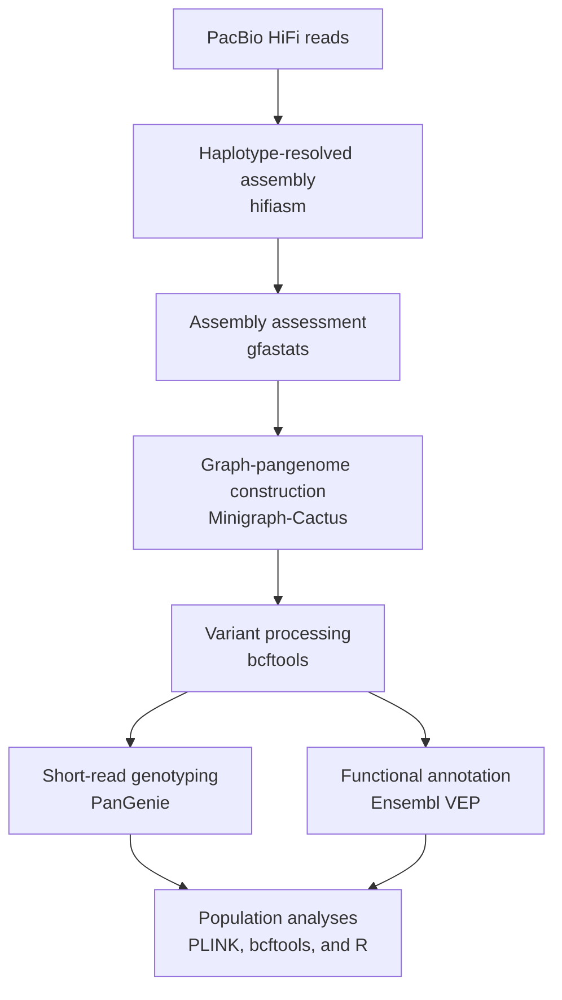

# Graph-Based Goat Pangenome and Structural Variation Analysis

This repository documents a research project on graph pangenomics and structural variation in domestic and wild goats. The workflow combines haplotype-resolved assembly of PacBio HiFi reads, graph-pangenome construction, variant discovery, short-read genotyping, functional annotation, and exploratory population-genomic analysis.

The project was carried out during a research traineeship at The Roslin Institute, University of Edinburgh.

> **Data availability.** Some of the assemblies and research outputs used in this project are unpublished or subject to data-sharing restrictions. Consequently, this repository contains computational scripts and selected non-sensitive summaries, but does not redistribute restricted sequence data or unpublished assemblies.

## Research objectives

Most population-genomic analyses rely on a single linear reference genome. This can introduce reference bias and limit the discovery and genotyping of structural variants. A graph pangenome represents sequence diversity from multiple assemblies within a shared coordinate system.

This project aimed to:

- generate haplotype-resolved assemblies from PacBio HiFi reads;
- combine new and publicly available *Capra* assemblies in a graph pangenome;
- identify and characterize small and structural variants;
- genotype graph-derived variants in additional short-read samples;
- annotate variants and examine population-level patterns.

## Workflow



## Repository structure

```
.
├── scripts/
│   ├── 01_assembly/            # hifiasm haplotype-resolved assembly
│   ├── 02_assembly_qc/         # gfastats, mashtree
│   ├── 03_pangenome/           # Minigraph-Cactus, odgi stats
│   ├── 04_variant_processing/  # SV extraction + R analysis
│   ├── 05_genotyping/          # FastQC, panel prep, PanGenie
│   ├── 06_annotation/          # VCF chunking, Ensembl VEP
│   └── 07_population_analysis/ # PLINK PCA / LD pruning
├── config/
│   └── paths.example.sh        # copy to paths.sh and edit (git-ignored)
├── environments/
│   └── environment.yml
├── results/
│   └── figures/                # exported figures live here
├── LICENSE
└── README.md
```

Each script performs one clearly defined stage. HPC submission scripts use Sun Grid Engine directives.

## Methods

### 1. Haplotype-resolved genome assembly

PacBio HiFi reads from five Italian goat individuals were assembled with **hifiasm**. Both haplotypes were retained, producing ten haplotype-resolved assemblies. Assembly statistics (length, contig count, N50, L50) were examined with **gfastats** before inclusion in the pangenome workflow.

### 2. Graph-pangenome construction

The newly generated assemblies were combined with publicly available domestic and wild *Capra* assemblies. The final **Minigraph-Cactus** input contained 37 named genomes or samples, including the reference, using the ARS1.2 goat reference sequence as the coordinate system. Main outputs:

- a graph in **GFA** format;
- a **GBZ** graph for downstream analysis and genotyping;
- a **HAL** multiple-genome alignment;
- a multisample **VCF** containing small and structural variants.

### 3. Variant processing and structural-variant analysis

The pangenome VCF was processed with **bcftools**: multiallelic decomposition/normalization, retention of biallelic records where required, and classification of insertions and deletions. Structural variants were defined using a minimum length of **50 bp**, then summarized by type, size, carrier frequency, and population distribution. For selected sharing analyses, haplotype-level calls were collapsed to biological individuals.

The unfiltered Minigraph-Cactus VCF contained **52,138,169 records**, as reported by `bcftools stats`:

| Variant category  | Number of records |
|-------------------|-------------------|
| SNPs              | 42,989,931        |
| Indels            | 5,719,335         |
| Multiallelic sites| 3,969,873         |

These categories are reported directly from the summary statistics and overlap; they are not mutually exclusive components that must sum to the total record count.

### 4. Short-read genotyping with PanGenie

Graph-derived variants were genotyped in additional short-read goat samples with **PanGenie**: preparation of a phased, biallelic panel; `bcftools` normalization; index construction; FastQC on the reads; per-sample genotyping; and merging/filtering of genotype calls. This extended variant analysis beyond the individuals represented by long-read assemblies.

### 5. Functional annotation

Variants were annotated with **Ensembl VEP**. Because of callset size, VCFs were split into chunks, annotated independently, and merged. The reference used for graph construction was ARS1.2; in Ensembl VEP that assembly is named ARS1, so `--assembly ARS1` is intentional rather than a different reference genome. Downstream prioritization focused on structural variants with predicted HIGH or MODERATE functional consequences.

### 6. Population-genomic analyses

Exploratory population-level analyses used **PLINK**, **bcftools**, and **R**: variant/sample filtering, LD pruning, principal component analysis, allele-frequency summaries, SV sharing and population-specific variant analysis, insertion/deletion size distributions, chromosome-level summaries, and gene-overlap/impact summaries. One downstream analysis included Alpine goat samples from France, Switzerland, and Italy.

## Selected project observations

These are descriptive project outputs; biological interpretation requires appropriate validation and is not presented here as evidence of causality.

- the pangenome VCF contained more than 52 million raw variant records;
- structural variants showed a broad size distribution, from the 50 bp threshold to multi-kilobase events;
- variant-sharing analyses identified both widely shared and population-restricted structural variants;
- population structure was examined across Alpine goat samples from France, Switzerland, and Italy;
- functional annotation enabled prioritization of HIGH- and MODERATE-impact variants.

## Software

| Task                                   | Software          |
|----------------------------------------|-------------------|
| HiFi genome assembly                   | hifiasm           |
| Assembly statistics                    | gfastats          |
| Genome-distance analysis               | Mash / Mashtree   |
| Graph-pangenome construction           | Minigraph-Cactus  |
| Graph inspection and manipulation      | odgi              |
| Variant processing and statistics      | bcftools          |
| Short-read quality control             | FastQC            |
| Short-read genotyping                  | PanGenie          |
| Functional annotation                  | Ensembl VEP       |
| Population-genomic analysis            | PLINK             |
| Statistical analysis and visualization | R                 |

Exact versions should be taken from `environments/environment.yml` and the HPC job scripts (`module load` lines) where available.

## Running the workflow

This project was developed on an institutional HPC system using Sun Grid Engine. Paths are centralized in a single config file rather than hardcoded:

```bash
cp config/paths.example.sh config/paths.sh
# edit config/paths.sh for your system, then:
export REPO_ROOT="$(pwd)"
qsub scripts/01_assembly/01_hifiasm.sh <SAMPLE_ID>
```

Before reusing a script: inspect its input/output variables, confirm tool and reference-genome versions, adjust CPU/memory/runtime/temporary-storage requests, and verify that restricted input data are available through an authorized source. The complete Minigraph-Cactus step requires substantial compute and can use more than one terabyte of temporary space.

## Reproducibility and scope

This repository is a documented research codebase and portfolio artifact, not a self-contained turnkey pipeline. Full reproduction is limited by restricted or unpublished input assemblies, the computational requirements of Minigraph-Cactus, dependence on institutional HPC scheduling, and the availability of matching ARS1.2 reference and annotation resources. It should be evaluated as evidence of the design and execution of a large-scale genomics workflow; individual scripts may require adaptation before running in another environment.

## Acknowledgements

Conducted at The Roslin Institute, University of Edinburgh, under the supervision of Prof. James Prendergast, with academic support from the University of Milan.

## Author

**Amirhomayoun Heidari**
MSc Biotechnology for the Bioeconomy, University of Milan
Research interests: bioinformatics, pangenomics, structural variation, and medical genomics
